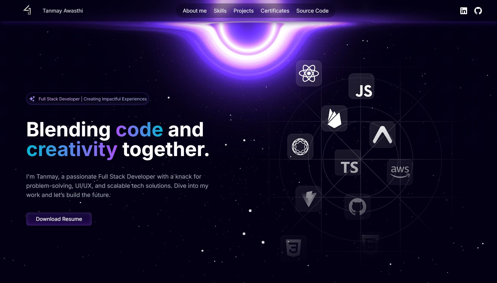

<a name="readme-top"></a>

# 🚀 Tanmay Awasthi | Developer Portfolio



## 🌐 Live Website
🔗 https://tanmay-portfolio-bld0.onrender.com

---

# 📌 About The Project

Welcome to my personal developer portfolio — a modern, space-inspired portfolio built to showcase my:

- 💻 Full Stack Development Skills  
- 🧠 DSA & Problem-Solving Journey  
- 🤖 AI / ML Projects  
- 📜 Certifications & Achievements  
- 📄 Resume & Professional Links  

This portfolio reflects my passion for building impactful digital experiences through clean UI, scalable development, and modern web technologies.

---

# 🛠 Tech Stack

### Frontend
- Next.js 14  
- React.js  
- TypeScript  
- Tailwind CSS  
- Framer Motion  

### Backend / Core
- Node.js  
- Express.js  
- MongoDB  
- Java  
- Python  

### Deployment
- Render  

---

# ✨ Features

## 🎯 Hero Section
- Animated introduction  
- Resume access  
- Personal branding  

## 🧠 Skills Section
- Frontend, Backend, Core Technologies  
- Clean categorized UI  

## 🚀 Projects Section
- Featured projects  
- GitHub links  
- Real-world development showcase  

## 📜 Certificates Section
- Interactive certificate unlock section  
- Verified certifications  

## 🔗 Social & Contact
- LinkedIn  
- GitHub  
- Resume  

---

# 📂 Folder Structure

```bash
tanmay-portfolio/
│── app/
│   ├── globals.css
│   ├── layout.tsx
│   └── page.tsx
│
│── components/
│   ├── main/
│   │   ├── hero.tsx
│   │   ├── skills.tsx
│   │   ├── projects.tsx
│   │   ├── encryption.tsx
│   │   ├── Certificates.tsx
│   │   ├── footer.tsx
│   │   └── navbar.tsx
│   │
│   └── sub/
│       ├── hero-content.tsx
│       ├── project-card.tsx
│       ├── skill-data-provider.tsx
│       └── skill-text.tsx
│
│── constants/
│   └── index.ts
│
│── public/
│   ├── skills/
│   ├── projects/
│   ├── videos/
│   └── hero-bg.svg
│
└── package.json

⚙️ Installation & Setup
Clone the repository
git clone https://github.com/Tanmay0405/Developer-portfolio.git
Navigate to project directory
cd Developer-portfolio
Install dependencies
npm install
Run development server
npm run dev
🚀 Deployment

This project is deployed on Render.

Build Command:
npm install && npm run build
Start Command:
npm start
📄 Resume

Resume is available directly through the portfolio website.

🎯 Future Improvements
🌟 LeetCode / DSA stats integration
📬 Contact form
🧩 More advanced project case studies
🎨 UI/UX enhancements
🌍 Custom domain
🤝 Connect With Me
LinkedIn:

https://www.linkedin.com/in/tanmay-awasthi-programmer4

GitHub:

https://github.com/Tanmay0405

⭐ Support

If you like this portfolio, consider giving this repository a star ⭐

<p align="right">(<a href="#readme-top">back to top</a>)</p> ```
